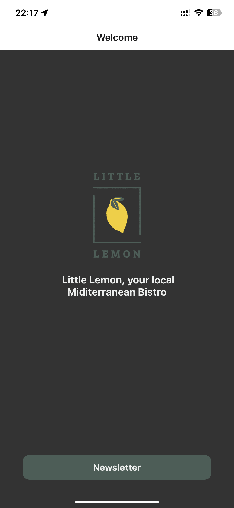

# Newsletter Subscription App

This is a simple React Native app that allows users to subscribe to a newsletter by providing their email address. The app has two screens:

- The first screen displays a message encouraging users to subscribe to the newsletter, and a button to navigate to the second screen.
- The second screen displays a text input field where users can enter their email address, and a button to submit the subscription.

## Getting started

To run the app, you'll need to have [Node.js](https://nodejs.org/) and [Expo CLI](https://docs.expo.io/workflow/expo-cli/) installed on your computer. Then, follow these steps:

1. Clone this repository:

   ```sh
   git clone https://github.com/your-username/newsletter-subscription-app.git
   ```
2. Install the dependencies:

    ```sh
    cd newsletter-subscription-app
    npm install
    ```
3. Start the app:
    ```sh
    npm start
    ```

This will open the Expo Developer Tools in your web browser. You can then run the app on an iOS or Android simulator, or on your own device using the Expo app.

## Technologies used

The app was written in React Native, using the following libraries:

- React Navigation for navigation
- Expo for development tools and utilities
Screenshots

Here are some screenshots of the app:<p>

